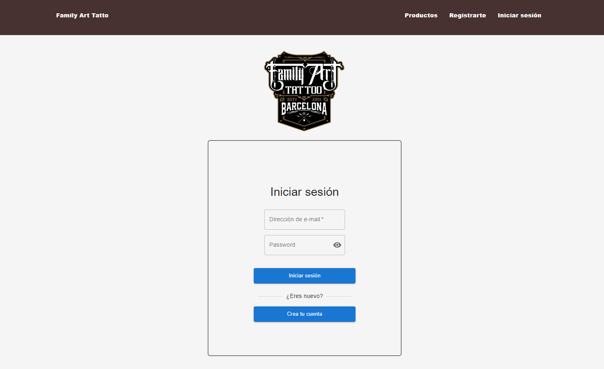
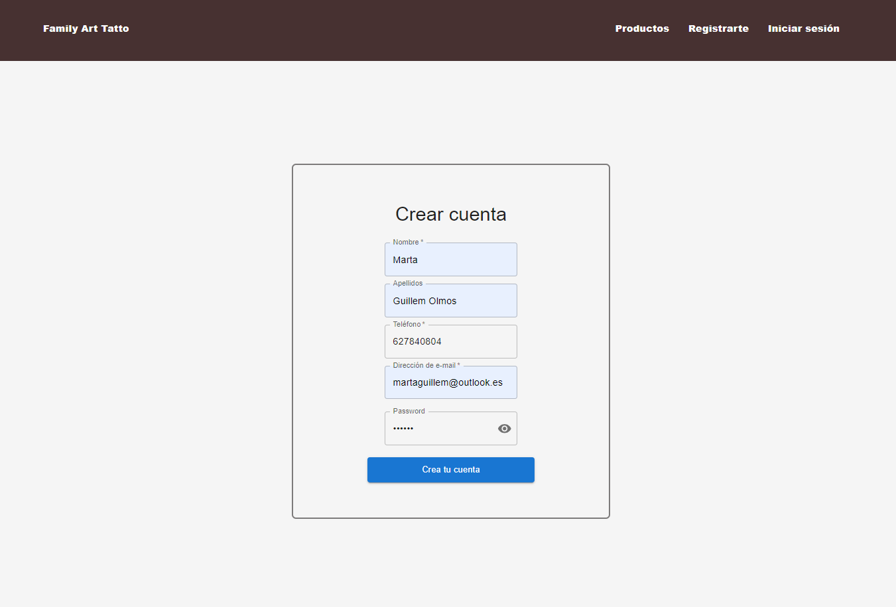
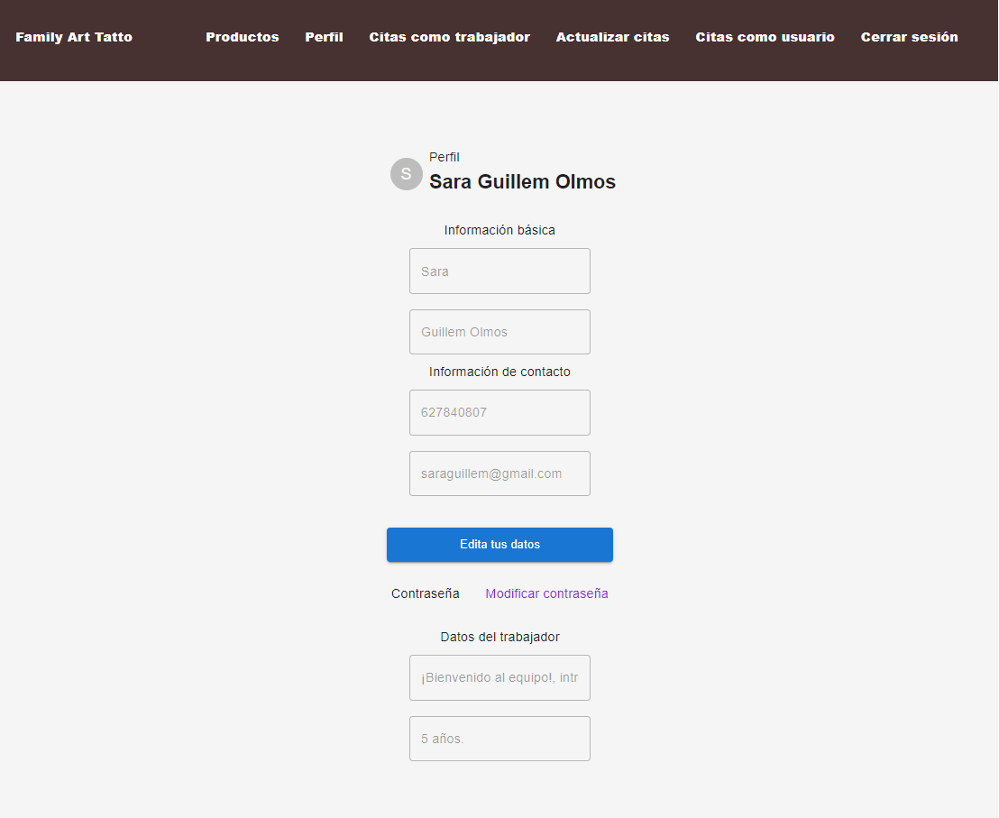
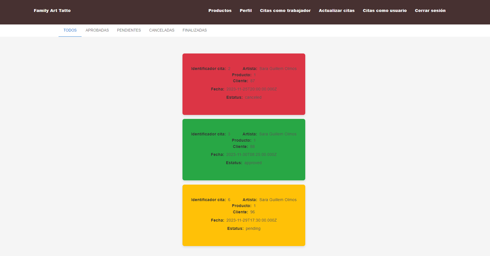
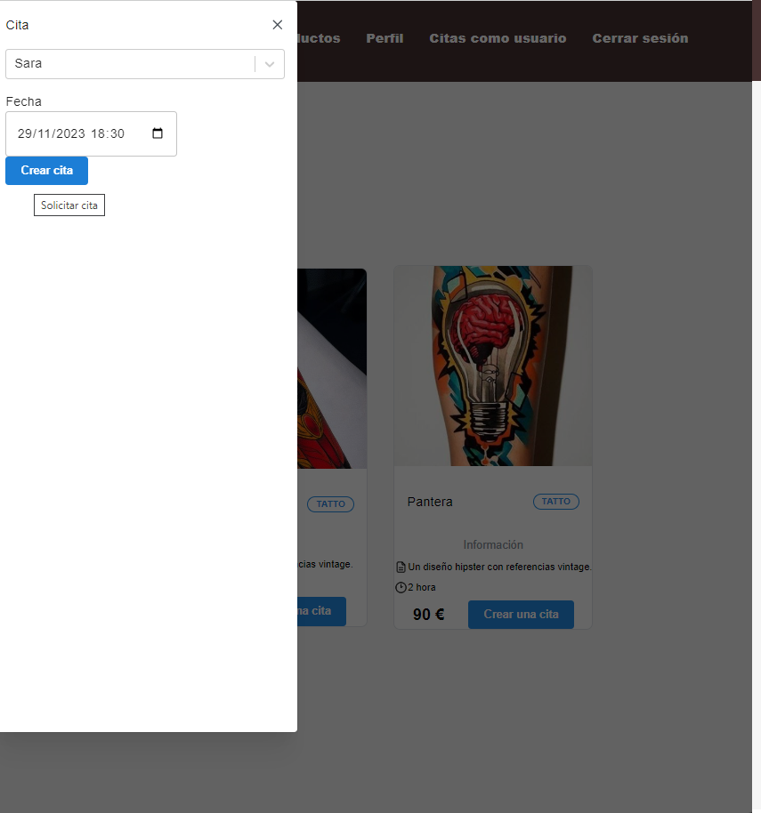
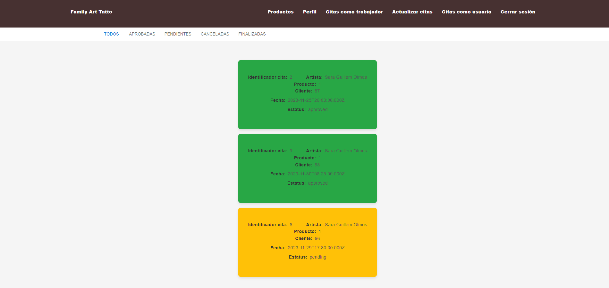
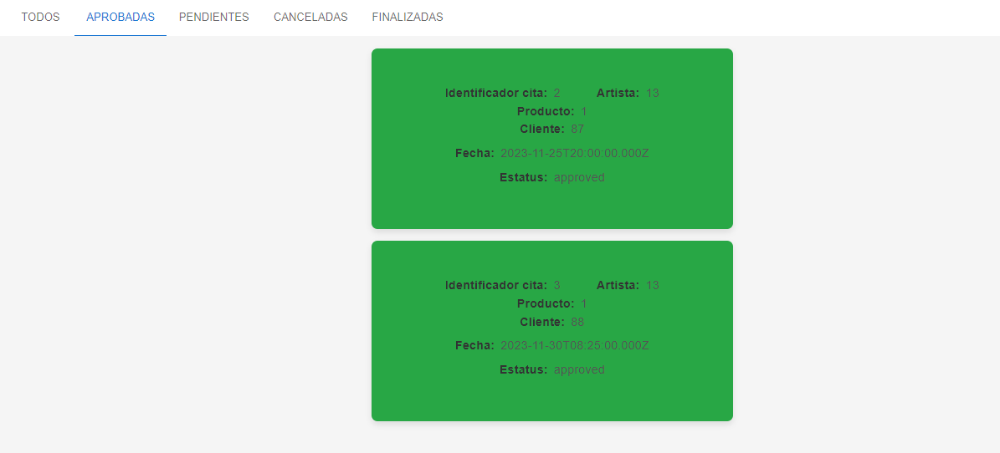
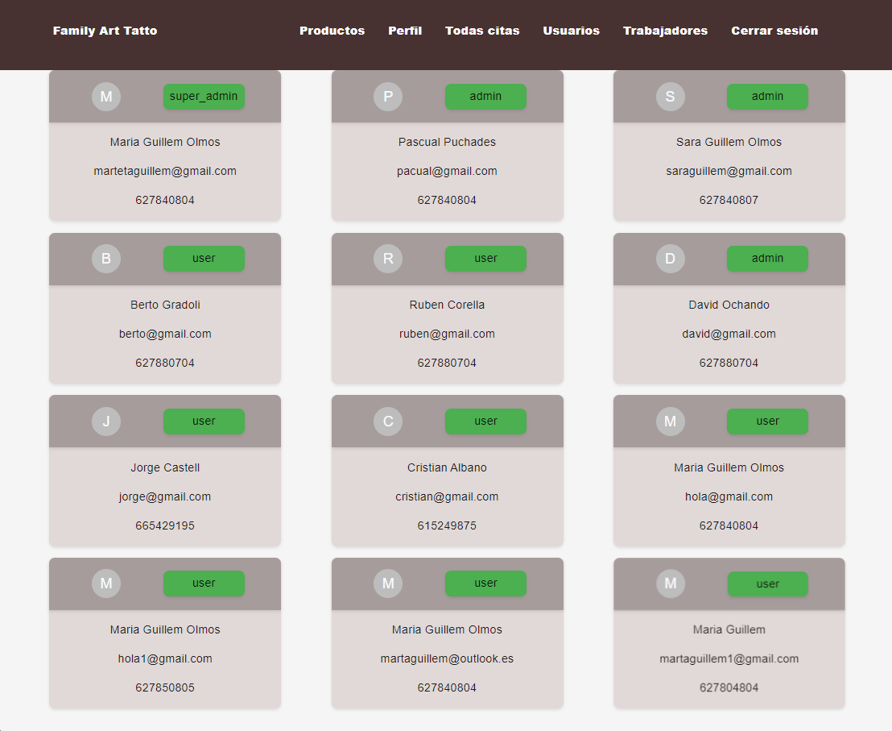
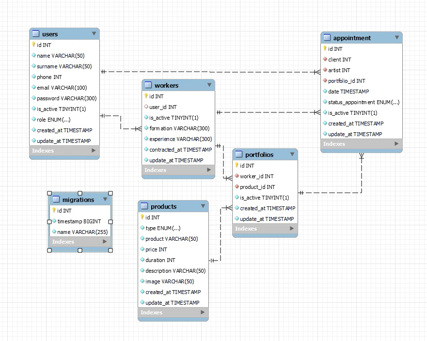
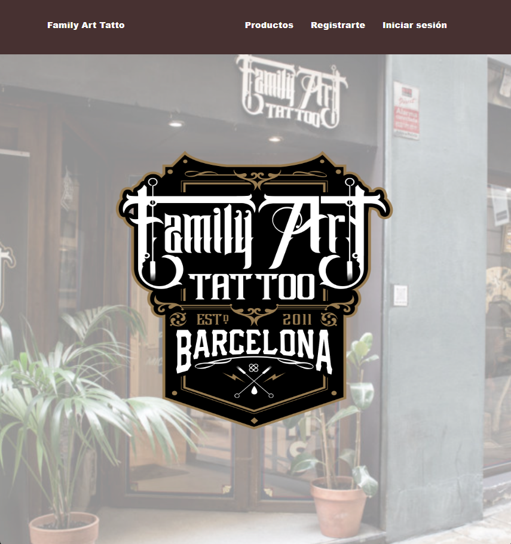

# README - ☠️ Estudio de Tatuajes ☠️
__
Proyecto 5 - Full Stack Developer Bootcamp en GeeksHubs Academy 
__

   

      
   
    

Fronted de un estudio de tatuajes, por Marta Guillem Olmos.
 

## Contenidos del Readme

- ### 🚀 [Descripcion](#descripcion)
- ### 🛠️ [Tecnologías Utilizadas](#tecnologías-utilizadas)
- ### 🎯 [Funcionalidades](#funcionalidades)
- ### 📉 [Diagrama de la Base de Datos](#diagrama-de-la-base-de-datos)
- ### ⚙️ [Instrucciones de uso](#intrucciones-de-uso)
- ### 📱 [Media Query](#media-query)
- ### 🌟 [Mejoras](#mejoras)
- ### 📧 [Contacto](#contacto)

---
## 🚀 Descripcion 

En este proyecto, nos enfrentamos al desafío de desarrollar la parte frontal de una aplicación que conectará con una API encargada de gestionar el modelo de negocio de un estudio de tatuajes. El objetivo principal es crear una plataforma versátil que permita a clientes, profesionales (tatuadores) y administradores acceder a información relevante según su rol específico.

---
## 🛠️ Tecnologias utilizadas:
Las tecnologías que hemos utilizado para desarrollar el proyecto son las siguientes:
- Javascript
- React
- Mantine
- Mui

---

## 🎯 Funcionalidades
A continuación desarrollaremos la funcionalidad del fronted.
#### Registro y Autenticación de Usuarios
Permite a los usuarios registrarse e iniciar sesión de manera segura.

   

      
   
    

   

      
   
    

#### Perfil de Usuario
Cada cliente y tatuador contará con un perfil de usuario personalizado donde podrán visualizar y editar sus datos personales.

   

      
   
    

#### Historial de Citas
Los clientes tendrán acceso a una vista que mostrará su historial de citas pasadas y futuras. Se valorará la implementación de funciones de búsqueda y filtrado para facilitar la exploración del historial.

   

      
   
    

#### Agendar Nueva Cita
Implementaremos una interfaz intuitiva que permitirá a los clientes agendar nuevas citas de manera sencilla y rápida.

   

      
   
    

#### Acceso de Tatuadores
Los tatuadores podrán acceder como profesionales, visualizando las citas futuras.

   

      
   
    

   

      
   
    

#### Vista de Administrador
El administrador contará con una vista que proporcionará acceso a la información de todos los usuarios y citas en la aplicación. Se podrán realizar operaciones de edición y borrado de usuarios y citas para gestionar eficientemente el sistema.

   

      
   
    

## 📉 Diagrama de la base de datos:
Adjuntamos el diseño de la base de datos que hemos empleado. También podéis acceder a él a través del repositorio, en [GitHub]((https://github.com/martaguillemolmos/backend.tattostudio)).

   

      
   
    

---

## 📱 Media Query
Este proyecto utiliza consultas de medios para garantizar que la página web se vea y funcione correctamente en diferentes tamaños de pantalla.
Este es el resultado desde un dispositivo móvil.

   

      
   
    

---

## ⚙️ Instrucciones de uso

 Instrucciones

1. Clona este repositorio en tu máquina local usando el siguiente comando: `git clone [URL del repositorio]`.
2. A continuación instala todas las dependencias con el comando ` $ npm install `
3. Por último, ponemos el marcha el proyecto con ` $ npm run dev `

---

## 🌟 Mejoras

La mejora que me gustaría implementar en este proyecto es conseguir un diseño más atractivo.

---
## ✒️ Contacto
Puedes contactar conmigo a través de los siguientes medios:
 - [GitHub]((https://github.com/martaguillemolmos)) - [LinkedIn](https://www.linkedin.com/in/marta-guillem-olmos-b26b9b293/)